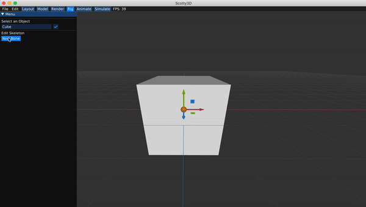
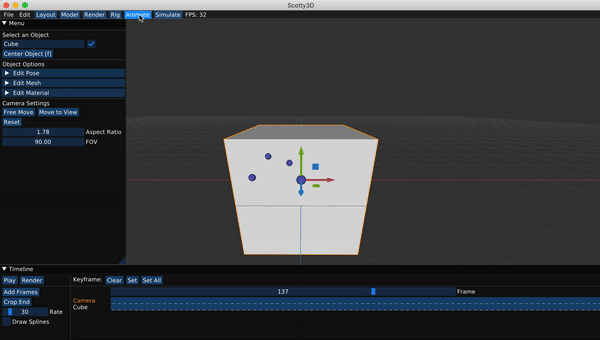

# Skeleton Kinematics

A `Skeleton`(defined in `scene/skeleton.h`) is what we use to drive our animation. You can think of them like the set of bones we have in our own bodies and joints that connect these bones. For convenience, we have merged the bones and joints into the `Joint` class which holds the orientation of the joint relative to its parent as euler angle in its `pose`, and `extent` representing the direction and length of the bone with respect to its parent `Joint`. Each `Mesh` has an associated `Skeleton` class which holds a rooted tree of `Joint`s, where each `Joint` can have an arbitrary number of children.

All of our joints are ball `Joint`s which have a set of 3 rotations around the , , and  axes, called _Euler angles_. Whenever you deal with angles in this way, a fixed order of operations must be enforced, otherwise the same set of angles will not represent the same rotation. In order to get the full rotational transformation matrix, , we can create individual rotation matrices around the, , and  axes, which we call , , and  respectively. The particular order of operations that we adopted for this assignment is that .

### Forward Kinematics

_Note: These diagrams are in 2D for visual clarity, but we will work with a 3D kinematic skeleton._

When a joint's parent is rotated, that transformation should be propagated down to all of its children. In the diagram below,  is the parent of  and  is the parent of . When a translation of  and rotation of  is applied to , all of the descendants are affected by this transformation as well. Then,  is rotated by  which affects itself and . Finally, when rotation of  is applied to , it only affects itself because it has no children.

You need to implement these routines in `student/skeleton.cpp` for forward kinematics.

*   `Joint::joint_to_bind` 
    Rreturn a matrix transforming points in the space of this joint
    to points in mesh space in bind position  up to the base of this joint (end of its parent joint). You should traverse upwards from this joint's parent all the way up to the root joint and accumulate their transformations. 
*   `Joint::joint_to_posed`
    Return a matrix transforming points in the space of this joint to points in mesh space, taking into account joint poses. Again, you should traverse upwards from this joint's parent to the root joint.
*   `Skeleton::end_of`
    Returns the end position of the joint in world coordinate frame, and you should take into account the base position of the skeleton (`Skeleton::base_pos`).
*   `Skeleton::posed_end_of`
    Returns the end position of the joint in world coordinate frame with poses, and you should take into account `Skeleton::base_pos`.
*   `Skeleton::joint_to_bind` 
    Rreturn a matrix transforming points in the space of this joint
    to points in mesh space in bind position but with the base position of the skeleton taken in to account. Hint: use some function that you have implemented wisely!
*   `Skeleton::joint_to_posed`
    Return a matrix transforming points in the space of this joint to points in mesh space, taking into account joint poses but with the base position of the skeleton taken in to account. Hint: use some function that you have implemented wisely!

Once you have implemented these basic kinematics, you should be able to define skeletons, set their positions at a collection of keyframes, and watch the skeleton smoothly interpolate the motion (see the [user guide](../guide/animate.md) for an explanation of the interface). The gif below shows a very hasty demo defining a few joints and interpolating their motion.

Note that the skeleton does not yet influence the geometry of the cube in this scene -- that will come in Task 3!

### Task 2b - Inverse Kinematics

#### Single Target IK

Now that we have a logical way to move joints around, we can implement Inverse Kinematics, which will move the joints around in order to reach a target point. There are a few different ways we can do this, but for this assignment we'll implement an iterative method called gradient descent in order to find the minimum of a function. For a function , we'll have the update scheme:

Where  is a small timestep. For this task, we'll be using gradient descent to find the minimum of the cost function:

Where  is the position in world space of the target joint, and  is the position in world space of the target point.

More specifically, we'll be using a technique called Jacobian Transpose, which relies on the assumption that:

Where:

*    (n x 1) is the function , where  is the angle of joint  around the axis of rotation
*    is a constant
*    (3 x n) is the Jacobian of 

Note that here  refers to the number of joints in the skeleton. Although in reality this can be reduced to just the number of joints between the target joint and the root, inclusive, because all joints not on that path should stay where they are, so their columns in  will be 0\. So  can just be the number of joints between the target and the root, inclusive. Additionally note that since this will get multiplied by  anyways, you can ignore the value of , and just consider the timestep as .

Now we just need a way to calcluate the Jacobian of . For this, we can use the fact that:

Where:

*    is the  column of 
*    is the axis of rotation
*    is the vector from the base of joint  to the end point of the target joint

For a more in-depth derivation of Jacobian transpose (and a look into other inverse kinematics algorithms), please check out [this presentation](https://web.archive.org/web/20190501035728/https://autorob.org/lectures/autorob_11_ik_jacobian.pdf). (Pages 45-56 in particular)

Now, all of this will work for updating the angle along a single axis, but we have 3 axes to deal with. Luckily, extending it to 3 dimensions isn't very difficult, we just need to update the angle along each axis independently.

#### Multi-Target

We'll extend this so we can have multiple targets, which will then use the function to minimize:

which is a simple extension actually. Since each term is independent and added together, we can get the gradient of this new cost function just by summing the gradients of each of the constituent cost functions!

You should implement multi-target IK, which will take a `std::map` of `Joint`s and target points for that joint. Each joint can only have 1 target point.

In order to implement this, you should update `Joint::compute_gradient` and `Skeleton::step_ik`. `Joint::compute_gradient` should calculate the gradient of  in the x,y, and z directions, and add them to `Joint::angle_gradient` for all relevant joints. `Skeleton::step_ik` should actually do the gradient descent calculations and update the `pose` of each joint. In this function, you should probably use a very small timestep, but do several iterations (say, 10s to 100s) of gradient descent in order to speed things up. For even faster and better results, you can also implement a variable timestep instead of just using a fixed one. Note also that the root joint should never be updated.

A key thing for this part is to _remember what coordinate frame you're in_, because if you calculate the gradients in the wrong coordinate frame or use the axis of rotation in the wrong coordinate frame your answers will come out very wrong!

#### Using your IK!
Once you have IK implemented, you should be able to create a series of joints, and get a particular joint to move to the desired final position you have selected.

