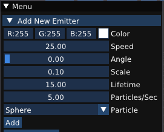
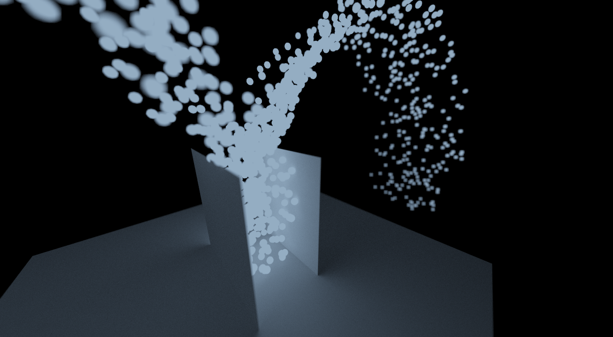

# Simulate

The simulation view provides a way to create and manage particle emitters. 

To add an emitter, open the dropdown menu, adjust desired parameters, and press `Add`.

- Color: color with which to render the particles.
- Angle: angle of cone within which particles are generated (pointing in the emitter object's direction).
- Scale: the scale factor to apply to the particle mesh when rendering particles.
- Lifetime: how long (in seconds) each particle should live before it is deleted.
- Particles/Sec: how many particles should be generated per second. The total amount of live particles is hence `lifetime * particles_per_second`.
- Particle: choose the shape of each particle.  If mesh objects are present in the scene, they will also show up here, allowing the creation of particles with custom shapes!
- Enabled: whether to immediately enable the emitter 

Once an enabled emitter is added to the scene (and animation task 4: particle simulation is implemented), particles will start generating and following trajectories based on the emitter parameters. Particles should collide with scene objects. When moving existing objects that particles interact with, the simulation will not be updated until the movement is completed. 

For example, the `particles.dae` test scene:

<video src="{{ site.baseurl }}/guide/simulate_mode/guide-simulate-1.mp4" controls preload muted loop style="max-width: 100%; margin: 0 auto;"></video>

Finally, note that you can render particles just like any other scene objects. Rendering `particles.dae` with depth of field:

